<h2>application java</h2>
<ul>
<li>exercace one</li>
<li>exercace two</li>
<li>exercace three</li>
</ul>
<h1>exercace one</h1>
<h2>main interface</h2>
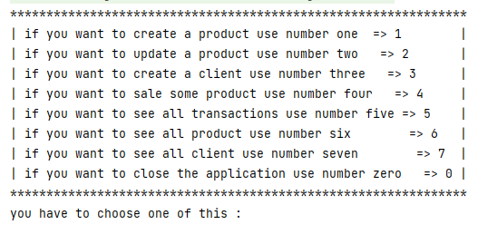
<h3>create Product</h3>
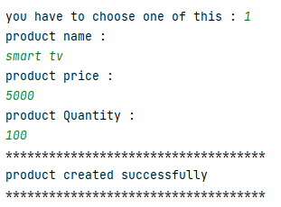
<h3>update Product</h3>
<h4>exception -> Product Not Found Exception</h4>
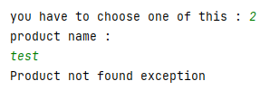
<h4>product updated successfully</h4>
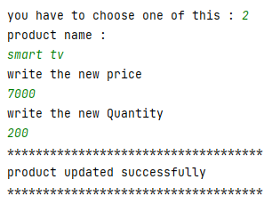
<h3>create client</h3>
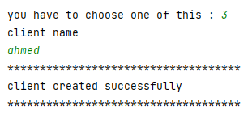
<h3>sale products</h3>
<h4>exception -> Product Not Found Exception</h4>
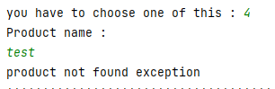
<h4>exception -> Client Not Found Exception</h4>
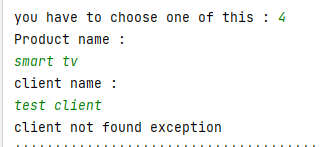
<h4>exception -> Quantity Not Available Exception</h4>
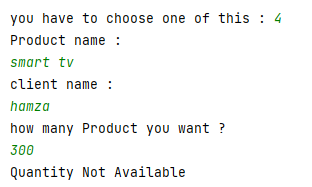
<h4>successfully</h4>
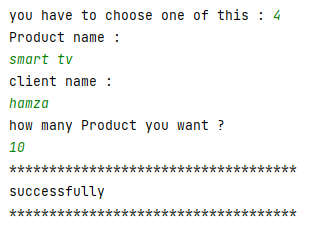
<h3>select all transactions</h3>
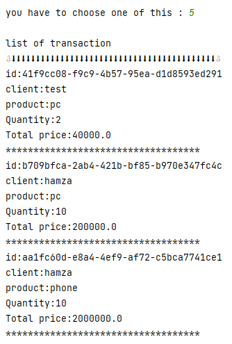
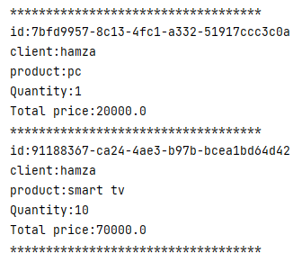
<h3>select all products</h3>
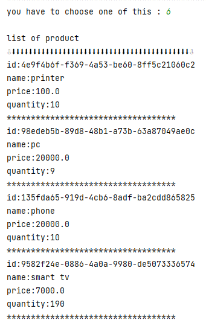
<h3>select all clients</h3>
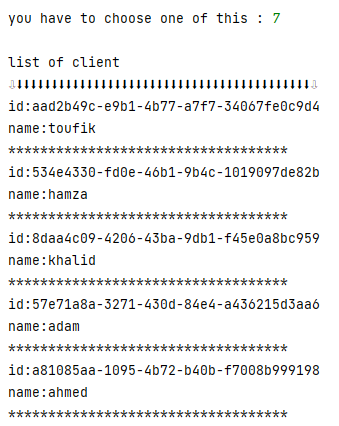

